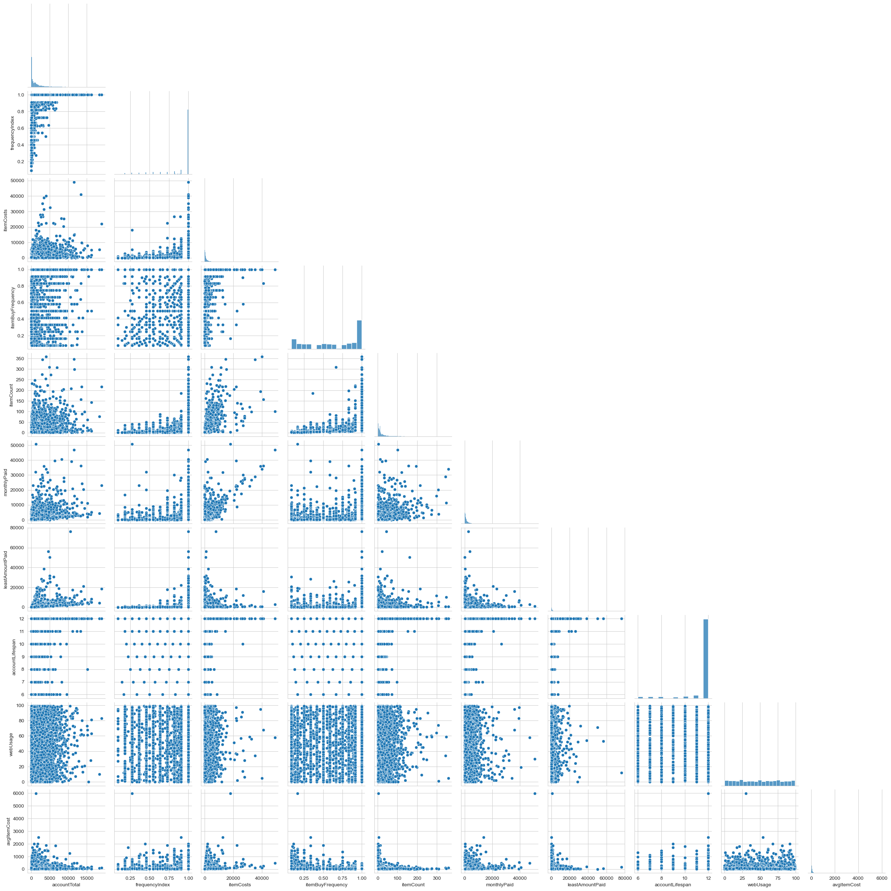
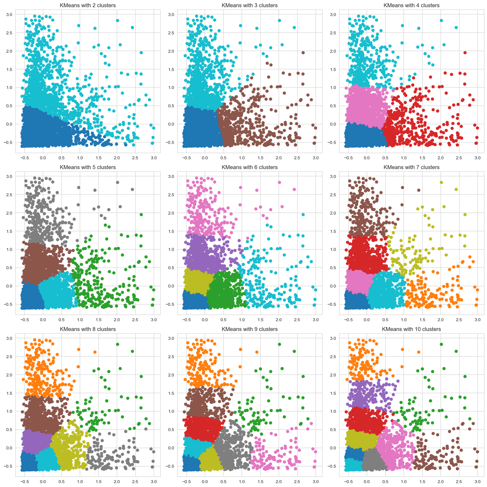

# Artificial Intelligence & Machine Learning Project

### AI &amp; Machine Learning group project at LUISS Fall 2023

##### Philip Fabrelius & Jan Stein

### 1. Introduction
 
The project aims to help the leading e-commerce platform ShopEasy to provide personalized user experiences, special promotions and improved services to their customers by understanding the buying habits and behaviors of their customers. This is done by applying segmentation to an extensive dataset provided by the platform.

To successfully carry out the task at hand, the following steps were performed:  
- Exploratory Data Analysis (EDA)
- Preprocessing of data
- Testing different clustering models and tuning
- Comparison and evaluation between different clustering models
Supervised classification model for analysis of common attributes within clusters
- Description of results

We identified two key features for our segmentation:  
- `Monthly Paid` - average amount spent on ShopEasy per month
- `Average Item Cost` - average price of items purchased by the customer

Our best clustering model returned the following five segments:
1. `Budget-Conscious` (bottom lower left corner)
2. `Regular Buyers` (above budget-conscious on the y-axis)
3. `Mid-Range Shoppers` (middle on the x-axis, ~0.0-1.0)
4. `Occasional Splurgers` (bottom right on the x-axis)
5. `Big Spenders` (top left on the y-axis)

### 2. Methods

#### 2.1 Imported Libraries
- `Pandas` - powerful and flexible library for data manipulation, analysis and working with dataFrames.
- `Seaborn` - great for statistical graphics.
- `Numpy` - library for large arrays and.matrices and mathematical operations for these.
- `Matplotlib` - great for data visualizations
- `Scikit learn` - great library for preprocessing and machine learning algorithms.

    - StandardScaler
    - KMeans
    - Silhouette_score
    - DBSCAN
    - AgglomerativeClustering
    - GaussianMixture

- `Scipy` - for calculation and visualization of hierarchical clustering.
- `TensorFlow` - for creating artificial neural network.

#### 2.2 EDA

**Description of the Dataset**  
We assume all costs and other features related to money presented as number of dollars.

- **personId**: Unique identifier for each user on the platform
- **accountTotal**: Total amount spent by the user on ShopEasy since their registration
- **frequencyIndex**: Reflects how frequently the user shops, with 1 being very frequent and values less than 1 being less frequent
- **itemCosts**: Total costs of items purchased by the user
- **singleItemCosts**: Costs of items that the user bought in a single purchase without opting for installments
- **multipleItemCosts**: Costs of items that the user decided to buy in installments
- **emergencyFunds**: Amount that the user decided to keep as a backup in their ShopEasy wallet for faster checkout or emergency purchases
- **itemBuyFrequency**: Frequency with which the user makes purchases
- **singleItemBuyFrequency**: How often the user makes single purchases without opting for installments
- **multipleItemBuyFrequency**: How often the user opts for installment-based purchases
- **emergencyUseFrequency**: How frequently the user taps into their emergency funds
- **emergencyCount**: Number of times the user has used their emergency funds
- **itemCount**: Total number of individual items purchased by the user
- **maxSpendLimit**: The maximum amount the user can spend in a single purchase, set by ShopEasy based on user's buying behavior and loyalty
- **monthlyPaid**: Total amount paid by the user every month
- **leastAmountPaid**: The least amount paid by the user in a single transaction
- **paymentCompletionRate**: Percentage of purchases where the user has paid the full amount
- **accountLifespan**: Duration for which the user has been registered on ShopEasy (in months)
- **location**: User's city or region
- **accountType**: The type of account held by the user. Regular for most users, Premium for those who have subscribed to ShopEasy premium services, and Student for users who have registered with a student ID
- **webUsage**: A metric (0-100) indicating the frequency with which the user shops on ShopEasy via web browsers. A higher number indicates more frequent web usage

**Scope**

For this assignment we're interested in investigating the relationship between the amount of money spent and the volume of products purchased, to better understand if customers are high/low value customers because of the cost of items purchased, or because of the amount of (cheap?) items purchased.

Therefore, and because of the size of the dataset, we have chosen to eliminate features that are not relevant for this investigation.

**Columns to be cut**

1. **paymentCompletionRate:** because it is a payment option related variable
2. **maxSpendLimit:** because it is already represented through spending, which is represented in monthly paid
3. **emergencyCount:** because it just reflects the customers preferred payment option, which is irrelevant for this investigation
4. **emergencyUseFrequency:** because of the same reason
5. **emergencyFunds:** because of the same reason
6. **singleItemCosts:** because they are only related to payment option
7. **MultipleItemCosts:** because they are only related to payment option
8. **singleItemBuyFrequency:** because they are only related to payment option
9. **multipleItemBuyFrequency:** because they are only related to payment option
10. **personId:** This variable is just an internal customer ID and does not matter for our purposes

**Descriptive Statistics**

We used the following methods to learn more about the data:

- `Describe() method` - to get more information about range of values, mean, standard deviatio, number of observations and distribution.
- `Info() method` - to get a concise summary of the DataFrame. This method is useful for quickly understanding the structure of the dataset. Using info(), you can quickly assess which columns may require type conversion or additional preprocessing due to null values or incorrect data types.
- `IsNull().sum() method` - The isnull().sum() method is a two-step operation specifically geared towards identifying missing values in the DataFrame. This method is particularly useful for data cleaning and preprocessing, as handling missing values is a critical step in preparing data for analysis or modeling.

**Data Removal**

From our base set of 8 950 rows, we identified some columns (`AccountTotal, ItemCost, ItemCount, MonthlyPaid`) with minimum values of 0 where we believe that the value should be > 0 to be relevant data points. We therefore decided to drop these rows, 2 258 dropped rows.  
32 missing values were found for leastAmountPaid and they were also dropped. 6 660 rows remain, 74.4% of the original data.

**Feature Engineering**

The dataset includes features for total amount of money spent (accountTotal), total amount of items purchased (itemCount), total cost of those items (itemCosts) and an average monthly spending variable (monthlyPaid). It does however not include a variable for the average item cost.

We add a variable for average item cost (`avgItemCost`) by dividing the itemCosts by itemCount.

**Analyzing Outliers**

We analyzed outliers in the dataset using a `boxplot`. Most columns have many distant outliers except the frequency features created by ShopEasy, which make sense as they are a relative range variable between 0-1 or 0-100. Valuable information for later steps.

Numerical outlier boxplot

**Analyzing Categorical Features**

Both categorical features consists of three evenly distributed values. `Location` (New York, Los Angeles and Chicago) and `AccountType` (Premium, Student and Standard).

Categorical countplot

**Analyzing Numerical Features**

As a part of the univariate analysis with the main purpose of describing and finding patterns for one variable, we used histograms to analyze the distribution of all remaining numerical features, here are some findings:

- `accountLifespan:` has the same value for >90% of the dataset. We suspect that this category is simply all accounts that have a lifespan of 12+ months, regardless of how much above 12 months they are in age. We have decided not to use this variable due to it being essentially the same value for almost all rows.

- `itemBuyFrequency:` This doesn't seem to be a univariate index. While we know it's a value between 0 and 1, even by removing rows we would not expect this type of skewed distribution favoring the maximal index point. We would expect it to look more like the `webUsage Distribution` chart.

Univariate histplot

**Bivariate Analysis**

Analyzing the relationship between two features using pairplots and correlation heatmap.

- Using a `pairplot` for our numerical features, we can get to know more about how our features are related to each other and if we can find patterns. Even though the outliers make it difficult, we find some interesting patterns. There are also some expected patterns where we for example see a positive relationship between item count and item cost, which makes much sense as purchasing more items often costs more money than purchasing less items.

Pairplot

- With the `correlation heatmap`, we can analyze the correlation between our features. When facing a clustering problem, it is important to understand the correlation as it can influence the formation of clusters for some algorithms (e.g., KMeans). A high correlation suggests a linear relationship. In our case, most of the features have a relatively low correlation and it is therefore not a big concern for this project.

Correlation heatmap

**EDA Conclusion**

After our extensive EDA, we decided to create clusters based on the features `MonthlyPaid` and `avgItemCost`. There are several reasons for this. These features give us information about both how much money the customer spends on average and what type of price range the customer buys from. Even though the average item cost does not give us all the information about the actual price of all items bought by the customer, it acts as a good proxy for that.  
We believe that this segmentation approach to identify clusters where ShopEasy can offer advertising of relevant price ranges to different segments and offer different discounts depending on how much the customer spends, as two examples.

#### 2.3 Preprocessing

**Encode Categorical features**

We used the `get_dummies` from pandas on our categorical features `location` and `accountType`. 

**Scale numerical values**

`StandardScaler` is a preprocessing technique used in machine learning and statistics. It standardizes the features of a dataset by removing the mean and dividing by the standard deviation, thus scaling each feature to unit variance. This process can be crucial for the performance of many algorithms, especially those that are sensitive to the scale of features.  
It is important to scale the data to ensure equalizing the importance of features, dealing with different units of measurement enhance interpretability.

**Type of problem & concerns with data distribution**

To analyze the buying behavior, we are specifically interested in the features **'monthlyPaid'** and **'avgItemCost'**. However, these include extreme outliers, as can be seen both in the outlier plots earlier in our EDA, as well as in the difference between the 75% and max columns in the .describe() method used above.

In order to better analyze the relationship of the larger customer group, we removed customers where these values are above 3 standard deviations in either or both of these values. Customers who end up in these extreme localities will instead be offered special services from a Customer Relations manager on an individual basis because it is difficult to generalize from outliers and their existence could seriously hamper the functionality of algorithms used to analyze the dataset. We removed 221 customers (3.3%)

We are left with a much more manageable dataset that is starting to show some patterns. Just from looking at it, we can see that while the majority of customers are centered around the mean 0 (as expected), there seems to be a considerable distinction between customers who have high monthly spending because of expensive items, and customers who buy expensive items but a lot less frequently. The distribution of remaining data points can be seen in this plot.

Scatterplot

#### 2.4 Clustering Algorithms

We decided to try the following four clustering methods:

- KMeans++
- Hierarchical clustering
- DBSCAN
- Gaussian Mixture

They vary in input parameters, scalability, usecases and distance metric used. Our goal was to find the best clustering method and hyperparameter tuning for our dataset and objective. We provide more details of every method below.

**KMeans++**

Kmeans clusters data by trying to separate samples in groups of equal variances, minimizing the `inertia` which is the average distance between all points of a cluster and its centroid, summed for all clusters. The basic version of KMeans is highly dependent on the random initialization of centroids, which may lead to the model returning a local minimum. The ++ method solves the problem by initializing the centroids far from each other.  
The method requires the user to decide the number of clusters as input before running the model. A helpful method to decide the best number of n is the `the elbow method`. By calculating the inertia for every number of n within a range and plotting the result in a line chart, you can find the point ('the elbow') where the model no longer returns a significantly lower inertia with one extra cluster.

In our model however, the elbow was not as clear as we would prefer. We decided to test another metric, the `Silhouette Score`. It measures how similar an object is to its own cluster and compared to other clusters. Ranging from -1 to +1, a score close to +1 indicates that points are well clustered, a score close to 0 indicates that the clusters are overlapping and a score close to -1 indicates that data points have been assigned to the wrong cluster.  
While the silhouette score might show a higher value for a certain number of clusters, it does not automatically mean that there is any semantic meaning in the clustering or whether the clustering reflects any relevant aspect for our data and objective. In clustering, there is not always an objective best clustering solution and in this case, we combined inertia, silhouette score and our own subjective visual inspection to decide that five clusters was the best solution for our case.

'Elbow method'

Cluster subplots

Silhouette score

Best cluster

**DBSCAN**

This method does not require the user to set the number of clusters *a priori* and no random seeds are involved. DBSCAN works with every shape, it does not assume a convex shape as KMeans for example. Moreover, it handles outliers well and excludes points not belonging to a nearby cluster. The central concept of this method is the `Core sample`, which are samples in areas of high density.   
DBSCAN uses two key inputs, the `minimum number of samples` and `eps` which defines how many points required to be within a certain distance for qualifying as being a core sample.

We tried combinations of eps between 0.05-0.15 and n_samples of 10-30. Higher eps creates larger dense clusters and some smaller more 'random' clusters while larger n_samples generates larger and fewer clusters, therefore we stayed within these ranges. The output for the lower number of samples created several small clusters that don't make much sense while the larger number mainly creates few large clusters without clear features of the segment. We decided to continue with an eps of 0.15 and n_samples of 20.

Cluster subplots

Silhouette score

**Hierarchical Clustering**

This method uses a bottom-up approach where each observations starts in its own cluster and then the closest clusters merge, one step at a time until only one clusters remain. There are several possible distance metrics, we decided to use `Ward` which is similar to KMeans for trying to minimize the variance within all clusters but with an agglomerative hierarchical approach.  
The best number of clusters can be analyzed using a `Dendogram` for a tree representation where the vertical distance represents what is called the `Linkage`. Where the linkage is the largest, is where the method merges the two furthest apart clusters.  

In our case, the highest linkage is between two and three clusters, indicating that two clusters are a good fit. However, similar to KMeans, it does not really make any semantic sense and we should consider other options. Looking at the visual representation, five clusters is another good option and we will continue with the two and five cluster options to the next step, but first we will have a look at the next method.

Dendogram

Linkage for last steps

Cluster subplots

Silhouette score

**Gaussian Mixture**

The final tested method was the Gaussian Mixture. This method clusters based on a Gaussian distribution of, in our case two, included features. The clustering results from this method reveals some problems with this method in combination with our dense dataset. We can see it for five clusters where one cluster for the same value on the y-axis is both on the left and right side of two other clusters, and the silhouette score supports our observation. However, we keep the results for two and five clusters for comparison between methods in the next section.

Cluster subplots

Silhouette score

### 3. Experimental Design

#### 3.1 Comparison between methods

To decide which method that is best for our data and objective we compare the best clustering from each method.

Comparing and evaluating clustering methods is a difficult task to perform, especially when there is no ground truth to compare the results to. If we had, we could as well use a supervised classification algorithm to predict the value. As we have discussed before, there are metrics available to evaluate clustering outputs, like silhouette score. However, these often don't work well in practice where shapes might be complex. Even if our silhouette score indicates a well-formed cluster, it might lack semantic meaning and reflection of aspects that are interesting for us. This leaves room for our subjective opinion looking at the visual representation, this is possible as we only use two features.

Cluster subplots

Silhouette score comparison

Despite high silhouette scores, we have decided to disregard segmentations with fewer than 3 clusters as we don't recognize any semantic meaning in these and they don't reflect our intention of properly creating actionable customer segments that can be used targeted advertisement and marketing campaigns. This eliminates:
- DBSCAN
- Gaussian Mixture with n=2
- Agglomerative/Hierarchical Clustering with n=2

leaving us with 3 remaining options:
- KMeans
- Agglomerative/Hierarchical Clustering with n=5
- Gaussian Mixture with n=5

We see issues with Gaussian Mixture n=5 both when it comes to the split cluster around (-0.5,0), and because of the vertical size of the right cluster, stretching from very low to very high monthly paid, essentially not discriminating between largely different customers.

Comparing the last 2 options, we prefer KMeans as it has a more semantically logical divide between spending habits and item cost, as well as a more diagonal split between high spending and high item cost customers.

#### 3.2 Supervised Model to Predict Segment

To get a better understanding for the properties and attributes of the segments created in our clustering methods, we do some brief investigation with classification algorithms to determine if there are any common denominators apart from the buying behaviour of our segments.

We add a new column to the already scaled and processed dataset that reflects the assigned cluster with an integer value (0-4). The variables that were used to create the clustering are removed to not leak information into the model, otherwise we would end up with a perfect prediction.

We use two different classification models:
- Decision Tree
- Artificial Neural Network

The primary objective of the decision tree model is to assist with determining feature importance due to the inherently high interpretability of decision trees. A GridSearchCV is subsequently used to improve model performance through tuning of hyperparameters.

An ANN is subsequently used in an attempt to maximize model performance on the available data. Various setups (2-8 hidden layers with 8-50 neurons per layer, 20-200 epochs, relu/sigmoid activation) were investigated in an attempt to minimize overfitting whilst maximizing generalization and accuracy on the test set.

### 4. Results

#### 4.1 Main Result from Clustering

Our final result from our KMeans++ method is illustrated in `figure X` and includes the following five clusters:

1. Budget-Conscious (bottom lower left corner)
2. Regular Buyers (above budget-conscious on the y-axis)
3. Mid-Range Shoppers (middle on the x-axis, ~0.0-1.0)
4. Occasional Splurgers (bottom right on the x-axis)
5. Big Spenders (top left on the y-axis)

The budget-conscious cluster contains customers who spend relatively small amount of money monthly and buys relatively cheap items on average. These are not the most profitable customers and might not require much special attention. However, they are many and it is good to have a good base offer to maintain the revenue stream from these customers.

The regular buyers spend more money than the budget-conscious segment, but still buy relatively cheap items. For this segment, we should put more focus on relevant product offerings and content to make sure that they continue buying products.

The mid-range shoppers buy slightly more expensive products on average but don't spend as much in total as the regular buyers. Here it becomes more important with offering the right products to this group, as they buy fewer but more expensive items.

The occasional splurgers can be a difficult group to provide with relevant content. They rarely buy items but when they do, they are buying expensive items. For this group, the content should focus on premium products.

The last group, the big spenders, tend to buy a lot of products within the relatively cheap price range but there can also be cases where they buy some expensive products and many cheaper products. We know that they have money to spend and we should make our biggest effort for this group.

#### 4.2 Placeholder for supervised comment

It would be a stretch to call the results from our classification models anything less than disappointing. Even after tuning, the decision tree approach barely cracked 60% accuracy, not significantly better than flipping a coin. And even our attempts to improve performance with a less interpretable but more powerful model like ANN was nothing less than a failure. Additionally, since our budget-conscious cluster holds approximately half of the customers with around average or less buying behaviour, the models barely cracked the stupidest possible approach of taking the average.

It seems that whilst the clusters quite clearly separate customers when it comes to buying behaviour, the attributes outside of this category overlap too much to make it possible to predict the appropriate clusters on them (at least with the information used in our model). 

This in itself however is an interesting finding, as it suggests that similar buying behaviour can arise in vastly different customer patterns. In order to better describe the customers in the clusters, one would likely need access to more informative attributes about demographics.

### 5. Conclusions

